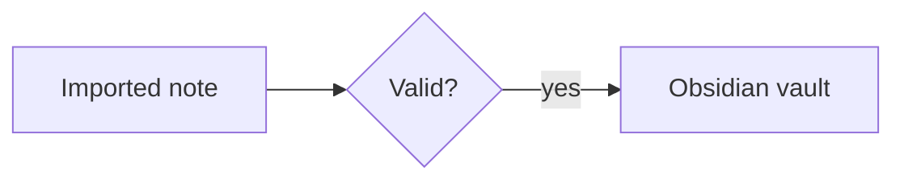

# Mermaid and MathJax

Both features are built into Obsidian Markdown; no community plugin is required.

## Mermaid

Use a fenced `mermaid` block:

````markdown

````

Use stable ASCII node IDs and quote visible labels containing spaces or special characters. Preserve comments and styling. Avoid click callbacks or external URLs unless explicitly requested.

To link nodes to notes, apply the `internal-link` class:


Resolution can be ambiguous for aliases, headings, or duplicate note names, so click-test the rendered nodes. These links do not appear in Graph view; also add ordinary wikilinks when graph/backlink discovery matters.

The Obsidian CLI can read and patch Mermaid source but does not validate rendering. Prefer a configured local Mermaid renderer when available, or open the note in Reading view and inspect the diagram. If neither is available, validate the fence and report that rendering remains unverified. Do not put sensitive note titles or excerpts into planning diagrams unless required, and never send private diagram text to an external editor without permission.

## MathJax and LaTeX Notation

Use single-dollar inline math:

```markdown
Euler's identity is $e^{i\pi}+1=0$.
```

Use double-dollar display math:

```markdown
$$
\begin{aligned}
f(x) &= x^2 + 2x + 1 \\
     &= (x+1)^2
\end{aligned}
$$
```

Obsidian renders TeX notation through MathJax; it is not a full LaTeX document processor. Do not add `\documentclass`, `\usepackage`, document environments, filesystem includes, or compilation instructions. Use only MathJax-supported commands and extensions.

Inspect and preserve the vault's existing delimiters and macro conventions before normalizing imported formulas. Preserve backslashes and delimiters during Markdown edits. Escape a literal dollar sign as `\$` when it could be parsed as math. For complex formulas, keep one display block per logical equation and verify in Obsidian Reading view.

Sources: [Obsidian advanced formatting](https://obsidian.md/help/advanced-syntax), [Mermaid documentation](https://mermaid.js.org/), and [MathJax TeX input](https://docs.mathjax.org/en/latest/input/tex/).
