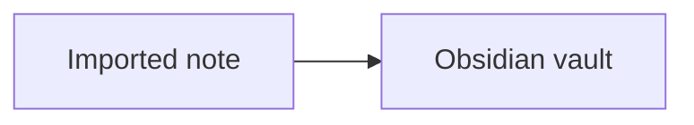

# Obsidian Mermaid

Use a fenced `mermaid` block:

````markdown

````

Use stable ASCII node IDs and quote visible labels containing spaces or punctuation. Preserve existing comments, directives, and styling.

Use the `internal-link` class for clickable note nodes, then verify resolution in Reading view. Add ordinary wikilinks outside the diagram when backlinks or Graph discovery matter.

The CLI can edit Mermaid source but does not prove that it renders. Open the note in Reading view or use an approved local Mermaid renderer.

## Discover more

Consult the current official Mermaid documentation for the requested diagram type and syntax. Use only the smallest relevant example; do not preload the entire Mermaid command reference.
